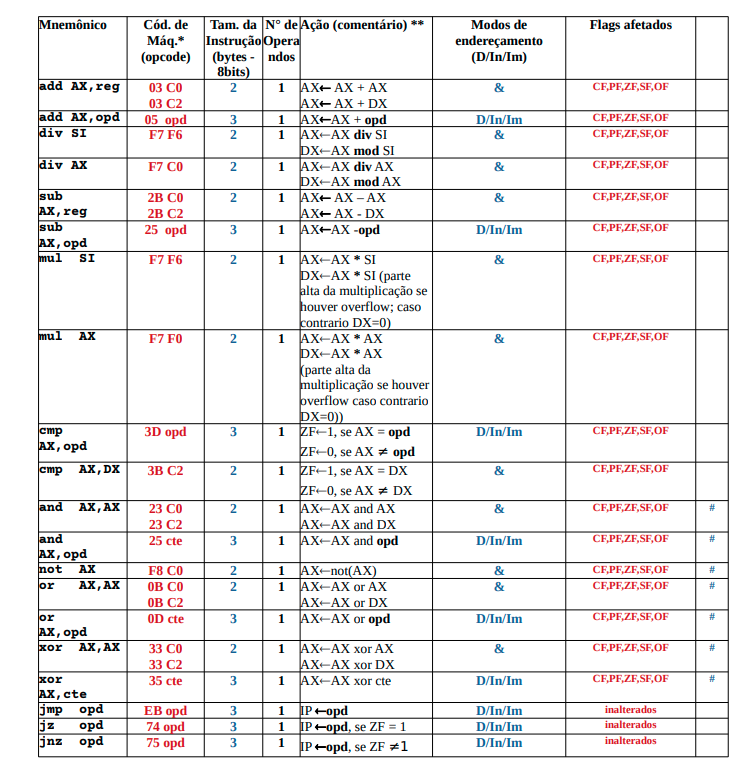
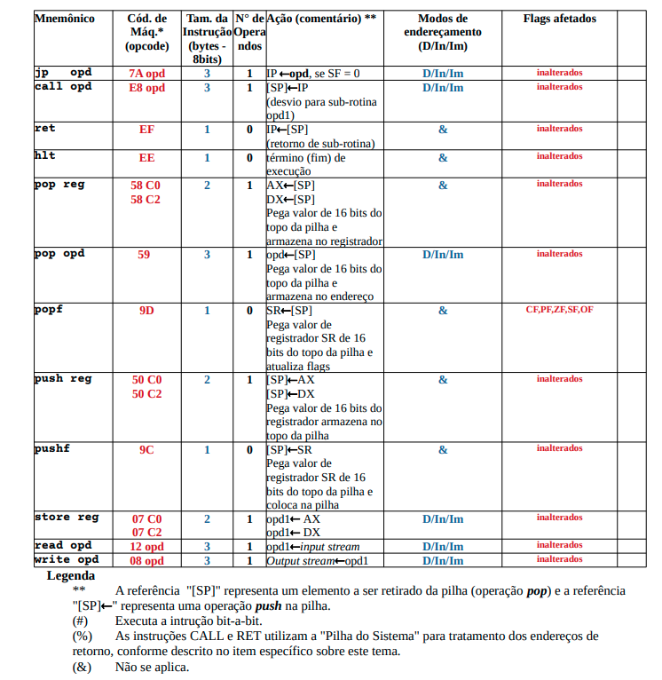
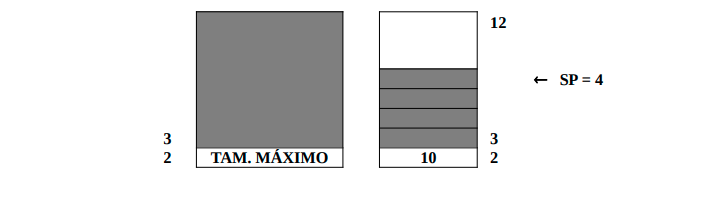
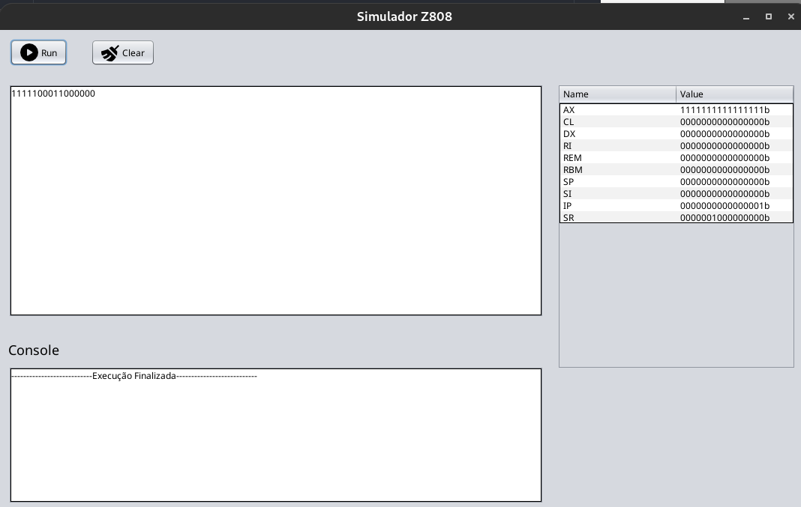
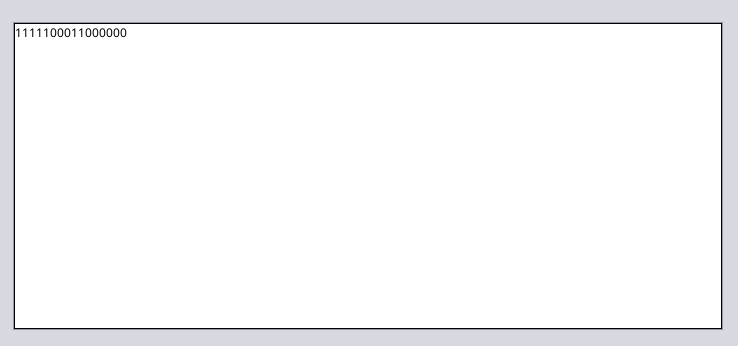
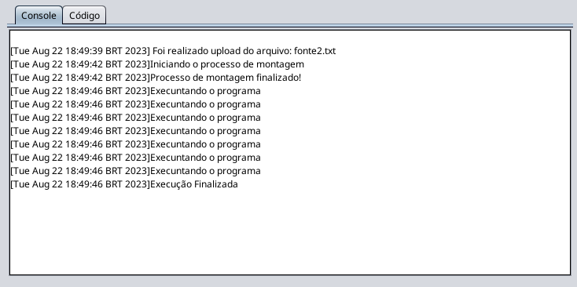
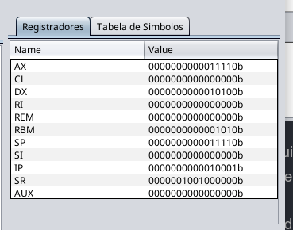

# Simulador-Z808

### _Repositório para o projeto máquina virtual do sistema computacional hipotético Z808_

### Observações 🚩

* Para mais especificações sobre o trabalho, olhar a seguinte pasta: _Docs_
* Integrantes: Alexandre Cardoso, Arthur Teles, Claudinei Lima, Igor Sakuma, Hyhickle Umetsubo, Luhan Moura, Mauricio Mucci
* Apresentação em vídeo do checkpoint 1/4: https://www.youtube.com/watch?v=B0Xyzax42kE&feature=youtu.be
* Apresentação em vídeo do checkpoint 2/4: -
* Apresentação em vídeo do checkpoint 3/4: -
* Apresentação em vídeo do checkpoint 4/4: -

### Objetivo 🎯

* Consiste em implementar a máquina virtual (emulador) do sistema computacional Z808 - conforme apresentado no livro _Tradução de programas da montagem a
carga por Cristian Koliver_. Tal sistema será composto de dois módulos que deverão operar de forma integrada: o executor
(emulador propriamente dito) e uma interface visual. 

### Descrição do emulador Z808 📝

1. Memória
* A memória do computador é definida pelos seguintes atributos:

|  Tamanho da memória  | 64KB |
|----------------------|------|
| Palavra de memória | 16b |
| Unidade de endereçamento | Palavra |
| Bit de paridade | NA |
| Cache | NA |

2. Registrador de dados
* O Z808 possui dois registradores de dados AX (Acumulador) e DX (Registrador de dados) de 16 bits.
  Os bits recebem um designação numérica de 0 a 15, da direita para esquerda, sendo o bit 0 o de mais baixa ordem 
  ou menos significativo.

3. Demais Registradores:
* A lista seguinte mostra os demais registradores implementados no computador hipotético e sua
descrição.

|  Registrador  | Tipo | Tamanho (bits) | Descrição |
|---------------|------|----------------|-----------|
| SP | STACK POINTER | 16 | Aponta para o topo da memória do tipo pilha. Usado pelas instruções push e pop. |
| SI | SOURCE INDEX | 16 | Aponta para a origem dos dados que serão movimentados. É usado para indexação de tabelas no endereçamento indireto. |
| IP | Instruction pointer | 16 | Contém durante a execução de um programa o endereço na memória da próxima instrução a ser executada. |
| SR | Status register | 16 | Contém seis flags de um bit. Usados para indicar várias condições durante a execução do programa. |

4. Conjunto de Instruções
* A seguir está definido o conjunto de instruções reconhecido pelo computador, acompanhado de todas as 
  informações necessárias para sua implementação. Cada código de instrução (opcode) e operando (opd1 ou opd2) 
  ocupa uma palavra de memória. As ações dizem respeito aos registradores, conforme identificação definida na 
  tabela de registradores e endereços de memória referenciados. As observações sinalizadas se são descritas na 
  legenda abaixo do quadro.

5. Pilha do Sistema

* Uma pilha é utilizada pelo sistema para armazenar os endereços de retornos de sub-rotinas, conforme indicado na
  seção sobre o "Conjunto de Instruções". Esta pilha do sistema é endereçada (acessada) através do registrador SP 
  (ponteiro da pilha).
  A pilha do sistema está localizada no início da memória física, a partir do endereço 2 (endereço base da pilha),
  cujo conteúdo não pode se desempilhado e deve manter o seu tamanho máximo (Stack Limit). O valor inicial do SP é
  implicitamente carregado com zero ao "ligar a máquina virtual". O ponteiro da pilha somente pode crescer 
  incrementando até seu limite, causando um desvio para o endereço 0 (zero), caracterizada como uma exceção de 
  "Stack Overflow", caso haja uma tentativa de empilhar com a pilha cheia. A estrutura da pilha é a seguinte:

6. Interface Gráfica

* A interface gráfica possui 3 áreas principais: caixa de texto para instruções, caixa de texto para o console e 
  uma tabela dos registradores.
* As instruções são inseridas em:

* Os erros ou exceções são exibidos em:

* Os valores dos registradores são exibidos em:

#### Tecnologias Utilizadas 💻

| Java |
|------|
|  17  |
